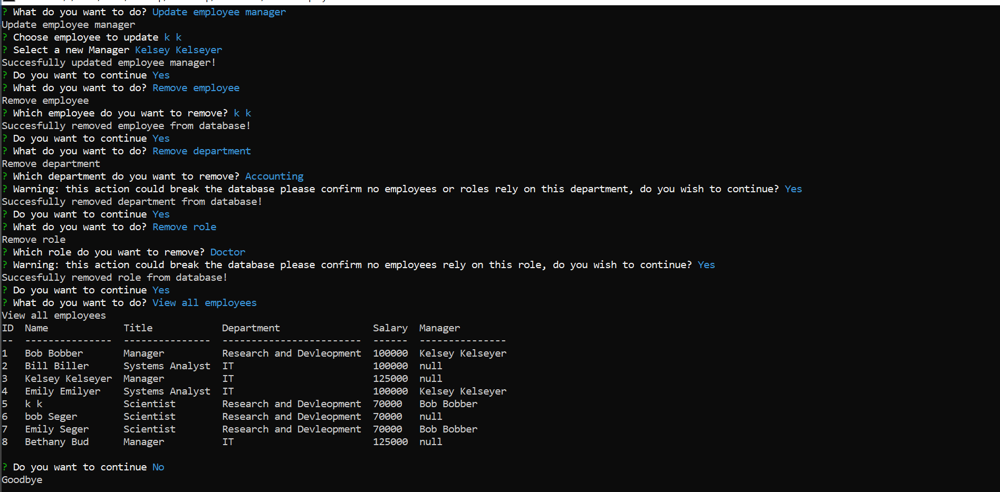

# Employee Tracker 
 

 
 ## Description 
 This Node.JS application allows a user to view add update and remove employees
 

 
 ## Table of Contents 

 * [Installation](#installation) 

 * [Usage](#usage) 

 * [License](#license) 

 * [Contributing](#contributing) 

 * [Tests](#Tests) 

 * [Questions](#questions)

 
 ## Installation 
 download repository and npm i and add .env file with user, password and database where: 
 * DB_NAME=?
 * DB_USER=?
 * DB_PASSWORD=?

 
 ## Usage 
 To use this application you must install all dependencies create the database and tables using the schema.db file and then type 'npm start' to start

 
 ## License 
 This application uses a license from MIT 
  
 * Link: https://opensource.org/licenses/MIT

 
 ## Contributing 
 none

 
 ## Tests 
 none

 
 ## Questions 
 Please find me on GitHub or email me with further questions:

 * GitHub: [kashelton17](https://github.com/kashelton17)

 * Email: kashelton17@gmail.com 
